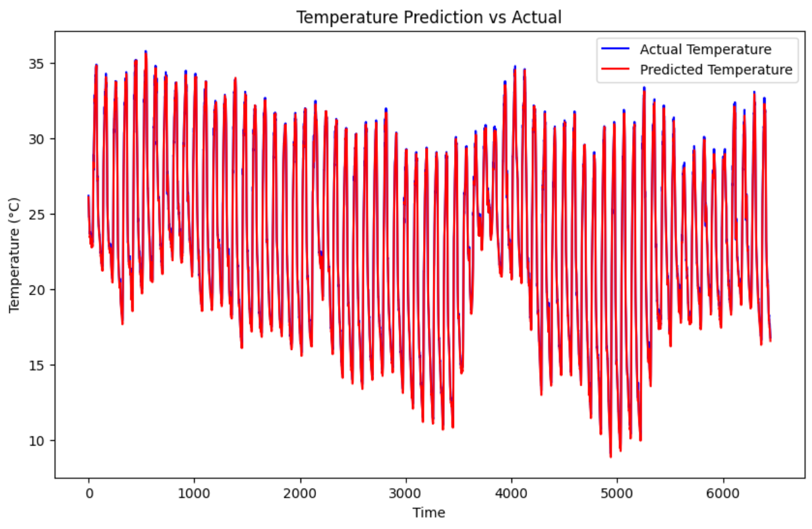
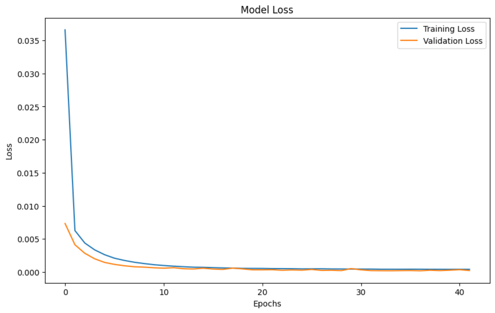

# 🌦️ Weather Forecasting using LSTM

## 📌 Overview
This project implements a deep learning-based time series forecasting system using LSTM (Long Short-Term Memory) networks to predict temperature and rainfall based on historical weather data.

---

## 🚀 Key Features
- 📈 Time-series forecasting using LSTM
- 🌡️ Temperature prediction
- 🌧️ Rainfall prediction
- 📊 Visualization of Actual vs Predicted values
- 📉 Model performance tracking using loss curves
- 🔄 Data preprocessing and scaling using MinMaxScaler

---

## 🧠 Tech Stack & Tools

### 👨‍💻 Programming & Libraries
- Python
- NumPy
- Pandas

### 🤖 Machine Learning / Deep Learning
- TensorFlow
- Keras
- Scikit-learn (for preprocessing)

### 📊 Visualization
- Matplotlib
- Seaborn

### 🛠️ Development Tools
- Jupyter Notebook / Google Colab
- Git & GitHub

---

## ⚙️ Workflow

1. Data Collection & Cleaning  
2. Feature Engineering  
3. Data Scaling (MinMaxScaler)  
4. Sequence Creation for LSTM  
5. Model Building (LSTM Layers)  
6. Model Training & Validation  
7. Prediction Generation  
8. Result Visualization  

---

## 📂 Project Structure

data/  
notebooks/  
outputs/  

--- 

## 📊 Results

### 📈 Actual vs Predicted

### 📉 Loss vs Epoch

---
## 👨‍💻 Author
**Aaryan Bhandare**
